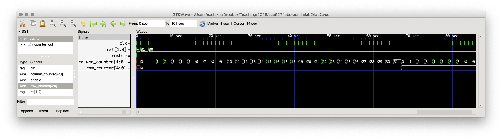
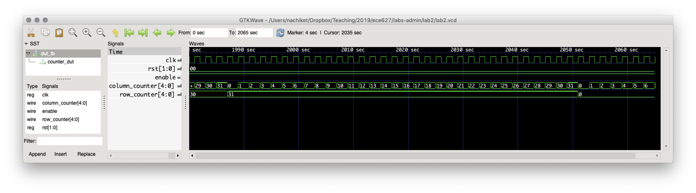
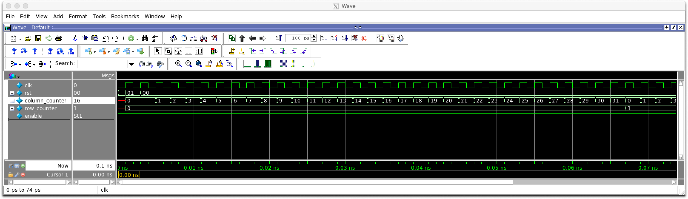
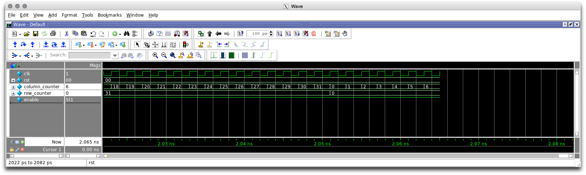
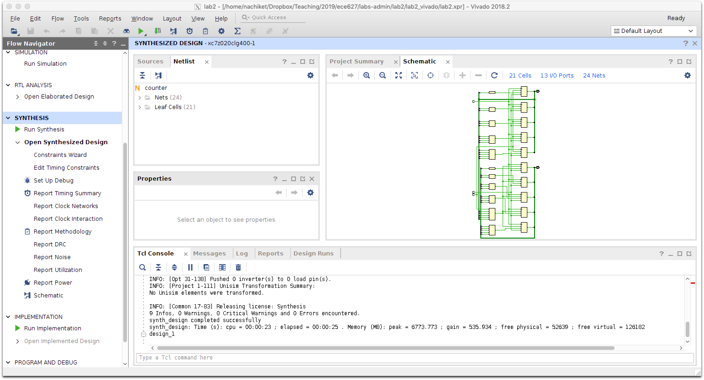
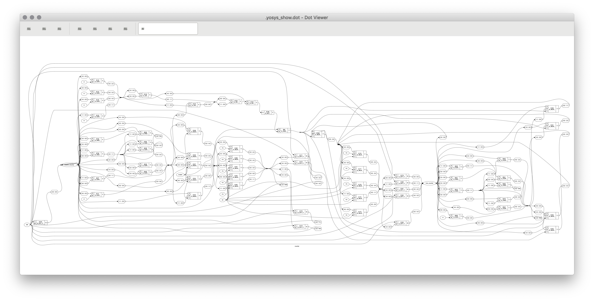

# LAB2 : Row and Column Counter (RCC) module : Simulation and Synthesis

## Objective :

The objective of this lab is to create a cascaded counter design. A cascaded
counter is a set of multiple counters, that enable the next one in a linear
cascade order. To loop through a 2D image or matrix, you need a row-column
counter. You will first need to count columns in a row, and then count rows
once all columns in a row have been counted. Thus, the first counter will run
through its range of counted values, and once it reaches the end, it will
generate an enable signal for the next counter in the cascade. This process
then repeats forever.

For this lab, you will develop a "**Row and Column Counter**" module. Specific
tasks are below: 

* Write Verilog code for the module that accepts an `enable` signal and generates two cascaded counter outputs `row_counter` and `column_counter`. 
* Simulate your module for functional correctness by using the testbench provided. Ensure that the generated result matches the expected golden result provided. One extra test based on `enable` signal has **not** been provided to you but will be used while grading.
* Synthesise your created design and estimate the quality of generated hardware by referring to the utlization of resource resport.

## Input Behaviour :
* We are designing a clocked module with `rst` and `clk` inputs.
* `rst` is asserted initially by the test bench for a single clock cycle.
* `enable` is asserted throughput the test to allow smooth counter operation.

## Output Behaviour :
* Once `rst` is asserted, your two outputs : `column_counter` and `row_counter` must be initialized to `0`
* When `rst` is deasserted, your design should follow the following principles for `row_counter` and `column_counter` respectively :

Column counting is conditional on the enable signal, but once enabled it performs the following operation:
```
column_counter <= (column_counter + 1) % WIDTH
```

Row counting is conditional on the column count having reached its largest value, and once enabled performs the following operation when `column_counter = WIDTH-1` i.e. if end of current row reached:
```
row_counter <= (row_counter + 1) % HEIGHT
```

### The images below capture the expected correct waveform : 

If you're using iverilog for the simulation, the generated waveforms for
validation are below. The first waveform captures the sequence of transitions
in the initial 30--40 cycle period of operation. The second waveform captures
the window of operation when both the `col_counter` and `row_counter` rollover
simultaneously.



Now, we show the same information for Modelsim waveform viewer.



The text trace below is the output of $display statements and captures the same
information as the waveforms above, for a clock period of 10 units:

```
VCD info: dumpfile lab2.vcd opened for output.
Time=1,Row=0,Column=0
Time=3,Row=0,Column=0
Time=5,Row=0,Column=1
Time=7,Row=0,Column=2
Time=9,Row=0,Column=3
Time=11,Row=0,Column=4
Time=13,Row=0,Column=5
Time=15,Row=0,Column=6
Time=17,Row=0,Column=7
Time=19,Row=0,Column=8
Time=21,Row=0,Column=9
Time=23,Row=0,Column=10
Time=25,Row=0,Column=11
Time=27,Row=0,Column=12
Time=29,Row=0,Column=13
Time=31,Row=0,Column=14
Time=33,Row=0,Column=15
Time=35,Row=0,Column=16
Time=37,Row=0,Column=17
Time=39,Row=0,Column=18
Time=41,Row=0,Column=19
Time=43,Row=0,Column=20
Time=45,Row=0,Column=21
Time=47,Row=0,Column=22
Time=49,Row=0,Column=23
Time=51,Row=0,Column=24
Time=53,Row=0,Column=25
Time=55,Row=0,Column=26
Time=57,Row=0,Column=27
Time=59,Row=0,Column=28
Time=61,Row=0,Column=29
Time=63,Row=0,Column=30
Time=65,Row=0,Column=31
Time=67,Row=1,Column=0
Time=69,Row=1,Column=1
Time=71,Row=1,Column=2
Time=73,Row=1,Column=3
.....
```

And, towards the end of the trace, you should see:
```
.....
Time=2031,Row=31,Column=22
Time=2033,Row=31,Column=23
Time=2035,Row=31,Column=24
Time=2037,Row=31,Column=25
Time=2039,Row=31,Column=26
Time=2041,Row=31,Column=27
Time=2043,Row=31,Column=28
Time=2045,Row=31,Column=29
Time=2047,Row=31,Column=30
Time=2049,Row=31,Column=31
Time=2051,Row=0,Column=0
Time=2053,Row=0,Column=1
Time=2055,Row=0,Column=2
Time=2057,Row=0,Column=3
Time=2059,Row=0,Column=4
Time=2061,Row=0,Column=5
Time=2063,Row=0,Column=6
Time=2065,Row=0,Column=7
```

## Creating your design : 

Update the file called `counter.v` already provided in the repository. The following should be the I/O ports of the module :

1. `clk` : 1 bit input : This is the clock input to the module
2. `rst` : 1 bit input : This is a synchronous active high reset signal.
3. `column_counter` : log2(width) bits output : This is the output of the column counter.
4. `row_counter` : log2(height) bits output : This is the output of the row counter.
5. `enable`: 1 bit input: This signal determines whether the counter is updated.

The column width (width) and row height (height) should be parameterised with a
`parameter` declaration. To compute the logrithm of the range (width, or
height) we will use the `$clog2` Verilog system task that supplies this
information at *compile time*. You have previously seen system tasks like
`$time` that are useful for simulation. The `$clog2` task is also useful for
synthesis to determine number of bits required.

## Testing your design : 

As with all labs, you have to use `jane.uwaterloo.ca` or
`deathstar.eng.uwaterloo.ca` for your lab work.

To compile and simulate test your module, simply type `make modelsim`. Modelsim
will start in GUI mode.  

If you prefer iverilog and gtkwave (OSS tools), you can use `make iverilog`
instead.

## Synthesizing your design : 

Synthesis is the process of generating hardware from your Verilog description.
This hardware can then be mapped to an FPGA or an ASIC chip. For this course, we
will focus primarily on mapping to Xilinx FPGAs. Synthesis is the first step
towards generating an executable FPGA bitstream.

To run synthesis and generate the utlization report, simply type `make
vivado`. Xilinx Vivado will start in GUI mode and launch synthesis. At the
end of synthesis, Vivado will generate a file called `utlization.txt` in the
same folder, with information about resource consumption of your design.

You can open `Schematic` view of your design and check if the design has
generated a bunch of FFs and LUTs.



Open `utilization.txt` and confirm that you have the following number of FFs and
LUTs.

```
.....

+----------+------+---------------------+
| Ref Name | Used | Functional Category |
+----------+------+---------------------+
| FDRE     |   10 |        Flop & Latch |
| LUT5     |    2 |                 LUT |
| LUT4     |    2 |                 LUT |
| LUT3     |    2 |                 LUT |
| LUT2     |    2 |                 LUT |
| LUT1     |    2 |                 LUT |
| LUT6     |    1 |                 LUT |
+----------+------+---------------------+
.....
```

[***ADMIN NOTE***: Must install pynq-z1 board files from https://github.com/cathalmccabe/pynq-z1_board_files/blob/master/pynq-z1.zip]

If you prefer OSS tools, you can use `make yosys` instead. The tool can `show` you the generated internal netlist for closer inspection.



The tool will also print statistics like shown below:

```
...
=== counter ===

Number of wires:                 11
Number of wire bits:             27
Number of public wires:           5
Number of public wire bits:      13
Number of memories:               0
Number of memory bits:            0
Number of processes:              0
Number of cells:                 24
FDRE                           10
LUT2                            3
LUT3                            2
LUT4                            2
LUT5                            2
LUT6                            4
MUXF7                           1
...
```
 
As you can see, `yosys` generates slightly larger hardware than `vivado`. You get what you pay for.

If you use `yosys`, remember to make sure `utilization.txt` reflects the output
of that tool.

## Submitting your solution

First off, just like lab1, you will need to **fork** this repository into your own space. Make sure to give 'nachiket@uwaterloo.ca' Guest permission to the forked repository.

Then you clone it the *forked* copy of the git repository onto your computer.

```
git clone gitlab@git.uwaterloo.ca:<username>/ece627-lab2.git
```


Then change working directory to the lab you just checked out

```
cd ece627-lab2
```

You can then fill in your solution code in `counter.v` and ensure that (1) the test output matches the waveforms shown above, and (2) resource utilization matches those reported in the synthesis utilization logs shown above.

You can commit your design in two steps:
```
git commit -a -m "solution is ready for grading"
git push origin master
```

You may commit and push as many times are you want prior to submission
deadline. In fact, I would encourage you to frequently commit and check-in your
code to the repository so you can track your design progress over time under
`Activity` tab on `git.uwaterloo.ca` in the browser.
